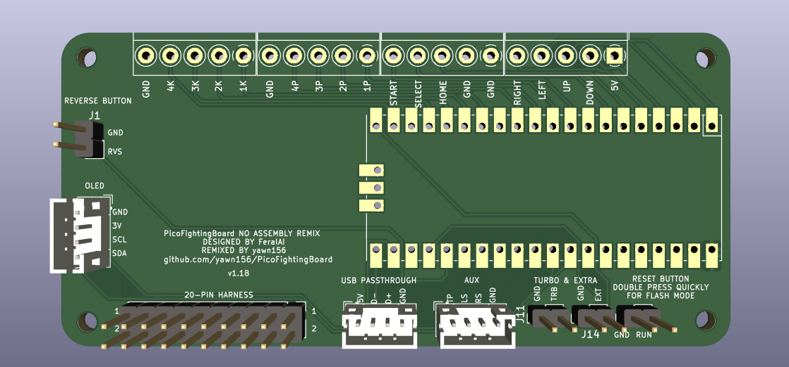

# Pico Fighting Board

Small fork of the OG Pico Fighting Board.

The idea behind this fork is for use with the [Open Stick](https://github.com/OpenStickCommunity/Hardware/tree/main/Fightstick%20Case) case, packing together less features than you would get from more advanced boards but also just enough to build a fightstick (with PS4/5 support with the new Passthrough addon).

Another important aspect about this fork is the focus on manual assembly to reduce costs and wait time for the big demand in common used parts from JLCPCB's assembly.

## List of Materials
- Raspberry pi Pico x1 
- JST PH 4Pin Male Terminal x3
- Screw Terminal 5Pin x4
- Male Pin header 10Pin x2
- Male pin header 2Pin x4

For wiring you'll either use the brook 20 pin connector or have a crimping tool with a bunch of 2.8mm female spade connectors.

## Firmware 
You'll want to use the PicoFightingBoard firmware from the [GP2040-CE](https://gp2040-ce.info/#/download) project.

The pins used for the connectors on the board are:
- USB Passthrough D+ = 21
- USB Passthrough D- = 22 (automatically set from the addon)
- Extra Button = 24
- Reverse button = 25
- TP = 26 *
- LS = 27 *
- RS = 29 *
- SDA = 31 *
- SCL = 32 *

(Pins marked with * may be already set in the webconfigurator.)

